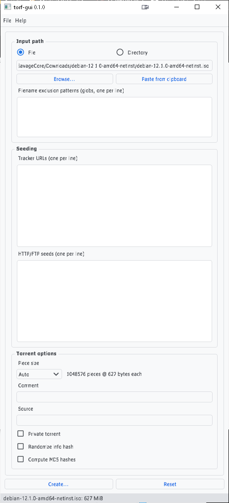
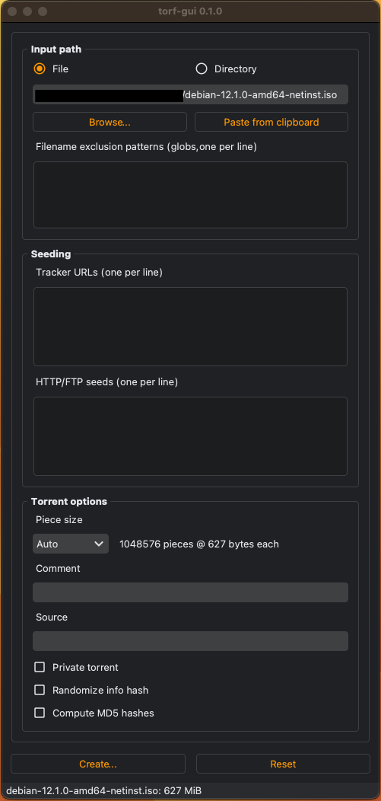

==============
torf-gui
==============

A quick and dirty port of `dottorrent-gui <https://github.com/kz26/dottorrent-gui>`_ for
`torf <https://github.com/rndusr/torf>`_

--------
Features
--------

* Fast (capable of several hundred MB/s)
* Cross-platform
* Full Unicode support
* Use multiple CPU cores to compute piece hashes
* Automatic and manual piece size selection, up to 16MB
* Batch torrent creation mode
* Filename exclusion patterns (globs)
* HTTP/web seeds support `(BEP 19) <http://www.bittorrent.org/beps/bep_0019.html>`_
* Private flag support `(BEP 27) <http://www.bittorrent.org/beps/bep_0027.html>`_
* Randomize info hash to help with cross-seeding
* User-definable source string
* Optional MD5 file hash inclusion
* `Import/export of profiles <https://github.com/SavageCore/torf-gui/wiki/Profiles>`_ (trackers, web seeds, source string, filename exclusion patterns)
* Automatic dark mode!

------------
Installation
------------

Windows
-------

Binary releases of stable versions for 64-bit Windows can be found at
`https://github.com/SavageCore/torf-gui/releases <https://github.com/SavageCore/torf-gui/releases>`_.
Download and run ``torf-gui-win64.exe``. You may need to download and install the `Microsoft Visual C++ Redistributable for Visual Studio 2015 <https://www.microsoft.com/en-us/download/details.aspx?id=48145>`_.

MacOS
-------
Binary releases of stable versions for 64-bit Windows can be found at
`https://github.com/SavageCore/torf-gui/releases <https://github.com/SavageCore/torf-gui/releases>`_.
Download and extract ``torf-gui-macOS.zip``. You may need to allow the app to run in your security settings.

Linux
------------------

**Requirements**

* Python 3.3+
* PyQt5 5.7+
* libxcb-xinerama0 (Debian/Ubuntu)

Latest stable release: ``pip install torf-gui``

Development: ``git clone`` this repository, then ``pip install .``

To run: ``torf-gui``

-------------
Portable Mode
-------------

torf-gui can be configured to run in portable mode, good for running from USB drives and network shares.
To enable this, simply create an empty file named ``torf-gui.ini`` in the same directory as the
main excecutable.

-------
License
-------

© 2023 Oliver Sayers. Made available under the terms of the
`GNU General Public License v3 <http://choosealicense.com/licenses/gpl-3.0/>`_.
